# 公文摆渡技能总览（T1-T15）

> 本文档是 book2skill 流水线的阶段 3 产出，汇总所有通过验证的技能，并建立它们之间的引用关系。v1.0 2026-05-21

---

## 技能总览

### T1 - 场景化写作与语言风格

| Skill ID | 名称 | 类型 | 分类 | 核心功能 | 来源视频 |
|---|---|---|---|---|---|
| changjing-xiezuo | 场景化写作法 | framework | 生成 | 忘记特殊文体，用正常人逻辑说话 | 视频55 |
| yuti-xuanze | 口语vs书面语体选择 | framework | 分析 | 判断用口语还是书面语 | 视频37 |
| huibao-changjinghua | 工作汇报场景化 | case | 生成 | 让领导听得懂、听得进去、能决策 | 视频17 |

### T2 - 工作汇报与信息报送

| Skill ID | 名称 | 类型 | 分类 | 核心功能 | 来源视频 |
|---|---|---|---|---|---|
| xinxi-baosong-liu-tiaolu | 信息报送六条路径 | framework | 生成 | 从领导讲话解锁选题方向 | 视频20 |
| mubiao-daoxiang-yu-jieguo-daoxiang | 目标导向与结果导向 | framework | 分析 | 判断用目标导向还是结果导向组织文章 | 视频24 |

### T3 - 论证与结构

| Skill ID | 名称 | 类型 | 分类 | 核心功能 | 来源视频 |
|---|---|---|---|---|---|
| tongxin-yuan-lunzheng | 同心圆论证法 | framework | 规划 | 从普遍性到特殊性层层聚焦 | 视频11 |
| liti-hua-lunzheng | 立体化论证法 | framework | 规划 | 引入第三对象使论证更立体 | 视频11 |
| zongfen-pingxing-tuijin | 总分平行递进结构法 | framework | 规划 | 总分抓点+平行抓线+递进抓面 | 视频47 |
| xiao-qiedao-da-changjing | 小切口大场景法 | framework | 生成 | 从小事件写出大文章 | 视频16 |

### T4 - 用词准确与格式规范

| Skill ID | 名称 | 类型 | 分类 | 核心功能 | 来源视频 |
|---|---|---|---|---|---|
| zhanwei-zhunque-yongci | 站位准确用词法 | framework | 优化 | 不同层级用词匹配，避免给领导挖坑 | 视频14 |
| zhici-geshi-guifan | 致辞格式规范法 | framework | 校验 | 领导致辞的标准格式与常见错误 | 视频2、3 |
| shuliang-zhengque-shiyong | 数量正确使用法 | framework | 校验 | 量词、数字、连接号、时间分隔符规范 | 视频18 |

### T5 - 领导致辞与讲话稿

| Skill ID | 名称 | 类型 | 分类 | 核心功能 | 来源视频 |
|---|---|---|---|---|---|
| san-ji-lingdao-jianghua-luoji | 三级领导讲话逻辑路径法 | framework | 生成 | 是什么/为什么/怎样做的降维框架 | 视频33 |
| dairu-shixiang-siwei | 代入式写作法 | framework | 生成 | 让讲话像领导本人讲的 | 视频38 |
| wuzhong-siwei-zonghe-yunyong | 五种思维综合运用法 | framework | 生成 | 代入+沉浸+延伸+链条+层级思维 | 视频38 |

### T6 - 工作总结与汇报

| Skill ID | 名称 | 类型 | 分类 | 核心功能 | 来源视频 |
|---|---|---|---|---|---|
| gongzuo-zongjie-kuangjia | 工作总结框架搭建法 | framework | 规划 | 索引性+完整性，焦点前置/后置 | 视频39、41 |
| wuzheng-xinxi-xuanti | 政务信息选题六类法 | framework | 生成 | 六类交叉，信息密度越大采用率越高 | 视频40 |
| zhongdian-gongzuo-huohua | 重点工作谋划四方面法 | framework | 生成 | 上级考核/落实要求/试点示范/国家战略 | 视频23 |

### T7 - 句式模板与表达提升

| Skill ID | 名称 | 类型 | 分类 | 核心功能 | 来源视频 |
|---|---|---|---|---|---|
| juxiang-daodian-jushi | 句式模板运用法 | framework | 生成 | 问题导向/持续推进/全链条行动三类句式 | 视频25 |
| yixiaojianda-jushi | 以小见大句式法 | framework | 生成 | 三个模板让文章有深度 | 视频27 |
| xiaoci-dianjing | 小词点睛法 | framework | 优化 | 三组小词让语言更亮眼 | 视频28 |

### T8 - 结构与逻辑

| Skill ID | 名称 | 类型 | 分类 | 核心功能 | 来源视频 |
|---|---|---|---|---|---|
| dianxianmian-goujian | 点线面构建法 | framework | 规划 | 三种类型让文章结构清晰 | 视频29 |
| luoji-zazong-zhenduan | 逻辑杂糅诊断法 | framework | 分析 | 检查因果与条件混用问题 | 视频32 |

### T9 - 宏观微观与问题导向

| Skill ID | 名称 | 类型 | 分类 | 核心功能 | 来源视频 |
|---|---|---|---|---|---|
| hongguan-weiguan-fenxi | 宏观微观分析法 | framework | 规划 | 从宏观供给侧和微观人民获得双维度分析 | 视频35 |
| yinyv-zhuangzhonggan | 音律庄重感法 | framework | 优化 | 四个音节为主的工作总结语言风格 | 视频43 |
| wenti-daoxiang-siwei | 问题导向式思维法 | framework | 规划 | 把负面问题转化为积极工作导向 | 视频44 |

### T10 - 亮点挖掘与承启句

| Skill ID | 名称 | 类型 | 分类 | 核心功能 | 来源视频 |
|---|---|---|---|---|---|
| sigong-liangan-faxin | 四角度挖掘工作亮点法 | framework | 生成 | 从问题/创新/要素/战略四角度挖掘亮点 | 视频60 |
| chengqi-ju-xiezuo | 承启句写作法 | framework | 生成 | 标题→承启句→细分点三级逻辑闭环 | 视频61 |
| wuchou-dagui | 五抽屉归纳法 | framework | 优化 | 用五套框架合并同类项 | 视频62 |
| sanwei-cailiao-xiefa | 三维材料写法 | framework | 转换 | 通讯稿/简报/信息的区分与写作 | 视频68 |

### T11 - 写作方法与场景适配

| Skill ID | 名称 | 类型 | 分类 | 核心功能 | 来源视频 |
|---|---|---|---|---|---|
| zerenxing-gongwen | 责任型公文金三角法 | framework | 生成 | 主体明确/价值共生/突破担当 | 视频70 |
| houban-juhua-luoji | 后半句话六种逻辑法 | framework | 生成 | 六种逻辑路径延展句子 | 视频72、73 |
| gongwen-sanyaoshi | 公文三钥匙法 | framework | 分析 | 文种定调/个性点睛/底线守稳 | 视频74 |
| zuotan-hui-fayan | 座谈会发言四方法 | framework | 生成 | 根据领导类型选择发言方法 | 视频75、76 |

### T12 - 亮点深化与材料升维

| Skill ID | 名称 | 类型 | 分类 | 核心功能 | 来源视频 |
|---|---|---|---|---|---|
| gongzuo-xinxi-gai | 工作信息改写法 | framework | 转换 | 工作总结改工作信息的思维转换 | 视频80 |
| tuoxu-xiangshi | 脱虚向实三步法 | framework | 生成 | 理念动词→任务动词，抽象→具体 | 视频81、82 |
| liangdian-chengxu | 亮点深化三模型 | framework | 生成 | 辩证呈现/系统集成/时空纵深 | 视频83、84 |
| shuzhi-baogao-fenqu | 述职报告与工作总结区分法 | framework | 分析 | 述职写"我"，总结写"事" | 视频88 |

### T13 - 马哲思维与青年干部述职

| Skill ID | 名称 | 类型 | 分类 | 核心功能 | 来源视频 |
|---|---|---|---|---|---|
| hexin-gongneng-qudong | 核心功能驱动框架 | framework | 生成 | 战略定位→核心功能→具体举措→成效数据 | 视频90 |
| wunian-niandu-chayi | 五年vs年度总结差异化法 | framework | 分析 | 四维区分：战略定位/内容架构/表述侧重/成果呈现 | 视频91 |
| changduan-qihua-fenceng | 长短期谋划分层法 | framework | 规划 | 战略层与执行层的架构与表述分层 | 视频92、93 |
| shuzhi-jiegouhua | 述职结构化三化法 | framework | 生成 | 标签化/数据化/框架化 | 视频94 |
| shuzhi-gushihua | 述职故事化三层面法 | framework | 生成 | 以我为主：独立负责/问题重构/价值创造 | 视频95 |
| maxue-renshilun | 马哲认识论写作法 | framework | 生成 | 获得认识→检验认识→应用认识 | 视频96 |
| maxue-shengchan-guanxi | 马哲生产力生产关系框架 | framework | 生成 | 建规则理利益优组织固关系 / 强主体硬技术改课体优效能 | 视频97、98 |
| biaoti-sanduanashi | 标题三段式写法 | framework | 生成 | 感性具体→理性本质→实践变革 | 视频99 |

### T14 - 演讲表达·材料思维·调研报告

| Skill ID | 名称 | 类型 | 分类 | 核心功能 | 来源视频 |
|---|---|---|---|---|---|
| yanshu-sanqiao | 演讲时空表达三技巧 | framework | 生成 | 时空交织/宏微结合/虚实递进 | 视频100 |
| dongbin-qunji | 动宾集群写作法 | framework | 生成 | 主客二分，六层客体化 | 视频101 |
| chengqi-jualiangbian | 承启句量变质变法 | framework | 生成 | 主导量变+关键机制+直接产物 | 视频102 |
| shiti-biaoshu | 实质性表述追问法 | framework | 生成 | 操作层面→功能层面→目的层面→战略层面 | 视频103 |
| tuogao-siwei | 脱稿思维汇报法 | framework | 生成 | 直截了当/领导逻辑/一针见血数据 | 视频105 |
| ansuofu-juzhi | 安索夫矩阵举措法 | framework | 生成 | 深耕现有/拓展范围/创新服务/开创新局 | 视频106 |
| gongzuo-duxiang | 工作分类矩阵法 | framework | 分析 | 高成长性×高掌控度=代表作等四象限 | 视频107 |
| cailiao-pingmian | 材料修改平面化法 | framework | 转换 | 垂直论证→平面清单三步骤 | 视频108 |
| jiaoliu-xuexi | 交流研讨学习思维法 | framework | 校验 | 赋能/破解老问题/新旧关联/拆解 | 视频109 |
| diaoyan-xinxin | 调研报告结构性新信息法 | framework | 生成 | 重新定义分析单元/提炼原理/建立刻度 | 视频111 |
| cuoshi-chengxiao-ju | 举措成效句边界法 | framework | 校验 | 定系统→划边界→问成效，避免越界承诺 | 视频104 |

### T15 - 框架搭建与公文规范性

| Skill ID | 名称 | 类型 | 分类 | 核心功能 | 来源视频 |
|---|---|---|---|---|---|
| jiaodian-qianzhi | 工作总结焦点前置框架法 | framework | 规划 | 五维度拆解：出发点/主线/手段/成效/保障 | 视频41 |
| jiaodian-houzhi | 工作总结焦点后置框架法 | framework | 规划 | 以成效为焦点，按影响对象分类 | 视频41 |
| gongwen-guifan | 公文规范性三避坑法 | framework | 校验 | 附体行文/标题回行/主送机关 | 视频15 |
| xitong-fenxi | 系统分析法 | framework | 分析 | 分析对象/文本/决策者需求，走近决策者 | 视频19 |
| lilun-wenzhang | 理论文章写作方向区分法 | framework | 分析 | 学者向vs领导向：话语体系匹配 | 视频42 |
| erji-biaoti | 二级标题六种逻辑维度法 | framework | 规划 | 时序/事项/主体/区域/对象/成效维度 | 视频78 |

---

## 引用关系图（Mermaid）

```mermaid
graph TD
    A[场景化写作法] -->|依赖| B[口语vs书面语体选择]
    A -->|具体应用| C[工作汇报场景化]
    B -->|应用场景| C
    C -->|相关内容| D[信息报送六条路径]
    C -->|相关内容| E[目标导向与结果导向]

    F[同心圆论证法] -->|结构支撑| G[总分平行递进结构法]
    F -->|补充方法| H[立体化论证法]
    G -->|写作思维| I[小切口大场景法]
    F -->|写作思维| I

    J[站位准确用词法] -->|格式支撑| K[致辞格式规范法]
    J -->|基础规范| L[数量正确使用法]
    K -->|内容检查| L

    M[三级领导讲话逻辑] -->|起点| N[代入式写作法]
    N -->|综合运用| O[五种思维综合运用]
    M -->|思维方式| O

    P[工作总结框架] -->|框架类型| Q[焦点前置/后置]
    P -->|布局方式| R[递进式优于并列式]

    S[句式模板运用] -->|问题导向| T[工作部署]
    S -->|持续推进| U[长期工程]
    S -->|全链条| V[监管执法]

    W[点线面构建] -->|结构类型| X[理论到实践]
    W -->|结构类型| Y[局部到整体]
    W -->|结构类型| Z[精准施策到示范]

    AA[宏观微观分析] -->|分析框架| AB[音律庄重感]
    AA -->|思维方法| AC[问题导向思维]
    AB -->|语言风格| AC

    AD[四角度挖掘亮点] -->|结构应用| AE[承启句写作]
    AD -->|归纳框架| AF[五抽屉归纳]
    AE -->|段落结构| AF
    AG[三维材料写法] -->|通讯稿| AD
    AG -->|简报| AE
    AG -->|信息| AF

    AH[公文三钥匙] -->|文种定调| AI[后半句话逻辑]
    AH -->|个性适配| AJ[座谈会发言方法]
    AI -->|逻辑路径| AJ
    AK[责任型公文金三角] -->|责任重构| AH

    AL[工作信息改写] -->|材料转换| AM[脱虚向实]
    AM -->|深化方法| AN[亮点深化三模型]
    AN -->|应用场景| AO[述职报告区分]
    AP[核心功能驱动] -->|汇报类型| AQ[五年vs年度差异化]
    AQ -->|谋划分层| AR[长短期谋划分层]
    AS[述职结构化] -->|故事化| AT[述职故事化]
    AT -->|主体性| AU[马哲认识论]
    AU -->|底层框架| AV[马哲生产力生产关系]
    AU -->|标题应用| AW[标题三段式]
    AV -->|虚实辩证| AW

    style AP fill:#fff9c4
    style AQ fill:#fff9c4
    style AR fill:#fff9c4
    style AS fill:#fff9c4
    style AT fill:#fff9c4
    style AU fill:#e1f5fe
    style AV fill:#e1f5fe
    style AW fill:#e1f5fe

    style A fill:#e1f5fe
    style B fill:#e8f5e8
    style C fill:#fff3e0
    style D fill:#fce4ec
    style E fill:#e8f5e8
    style F fill:#e3f2fd
    style G fill:#e3f2fd
    style H fill:#e3f2fd
    style I fill:#fff9c4
    style J fill:#f3e5f5
    style K fill:#f3e5f5
    style L fill:#e8f5e8
    style M fill:#e8f5e8
    style N fill:#e8f5e8
    style O fill:#e8f5e8
    style P fill:#e8f5e8
    style Q fill:#e8f5e8
    style R fill:#e8f5e8
    style S fill:#e8f5e8
    style T fill:#e8f5e8
    style U fill:#e8f5e8
    style V fill:#e8f5e8
    style W fill:#e8f5e8
    style X fill:#e8f5e8
    style Y fill:#e8f5e8
    style Z fill:#e8f5e8
    style AA fill:#e8f5e8
    style AB fill:#e8f5e8
    style AC fill:#e8f5e8
    style AD fill:#e8f5e8
    style AE fill:#e8f5e8
    style AF fill:#e8f5e8
    style AG fill:#e8f5e8
    style AH fill:#e8f5e8
    style AI fill:#e8f5e8
    style AJ fill:#e8f5e8
    style AK fill:#e8f5e8
    style AL fill:#e8f5e8
    style AM fill:#e8f5e8
    style AN fill:#e8f5e8
    style AO fill:#e8f5e8
```

---

## 技能详解

### 1. 场景化写作法 (changjing-xiezuo)

**一句话总结**：写公文时忘记"公文"这个特殊身份，用正常人逻辑说话。

**核心方法**：
1. 明确场景（什么场合、对谁说、什么目的）
2. 分析受众预期（受众想听到什么）
3. 用正常人逻辑说一遍（抛开"公文腔"）
4. 去修辞化检查（隐喻不超过1层）

**适用场景**：
- 写讲话稿/汇报稿时不知道用什么语气
- 被领导说"太虚"、"不接地气"
- 模仿范文却差点意思

---

### 2. 口语vs书面语体选择 (yuti-xuanze)

**一句话总结**：政策文件用书面语（准确凝练），讲话稿用口语语体（亲切易懂）。

**核心方法**：
1. 判断文本类型（口语：讲话稿/致辞稿/汇报稿；书面：报告/纪要/政策文件）
2. 查对应场景的极端例子
3. 对照词汇表判断
4. 检查口语化转换（专有名词→上位表达）

---

### 3. 工作汇报场景化 (huibao-changjinghua)

**一句话总结**：工作汇报要让领导听得懂、听得进去、能辅助决策，核心是提供参照系。

**核心方法**：
1. 建立共同语境
2. 提供数据+参照系（同比/占比/位次）
3. 让结论可判断
4. 检查领导能否action

---

### 4. 信息报送六条路径 (xinxi-baosong-liu-tiaolu)

**一句话总结**：从领导讲话出发，用六条路径挖掘信息报送选题。

**六条路径**：
1. 领导讲话 + 政策热点
2. 领导讲话 + 市场需求
3. 领导讲话 + 技术创新
4. 领导讲话 + 模式创新
5. 领导讲话 + 国内外经验借鉴
6. 领导讲话 + 文化融合

---

### 5. 目标导向与结果导向 (mubiao-daoxiang-yu-jieguo-daoxiang)

**一句话总结**：目标导向设定方向（适合规划），结果导向强调产出（适合总结）。

**判断方法**：
- 面向未来（规划/方案）→ 目标导向
- 面向过去（总结/报告）→ 结果导向

---

## 术语词典

| 术语 | 定义 | 来源 |
|---|---|---|
| 场景化写作 | 忘记特殊文体，用正常人的逻辑和语言说话 | 视频55 |
| 曲妹 | 公文写作中的别扭、不自然、用词过度考究 | 视频55 |
| 去修辞化 | 删除不必要的隐喻，保留朴素直接 | 视频55 |
| 公文语言的口语表达 | 口语化了的书面表达，用于讲话稿等口语场景 | 视频37 |
| 公文语言的书面表达 | 典范的书面语，用于政策文件等 | 视频37 |
| 去专名化 | 将专有名词替换为更通俗的上位表达 | 视频37 |
| 参照系 | 将数据放在可比较的维度里（同比/占比/位次） | 视频17 |
| 信息差 | 你作为信息富集者与领导之间的信息不对称 | 视频17 |
| 六条路径 | 从领导讲话解锁信息报送选题的六条路径 | 视频20 |
| 目标导向 | 设定明确目标，指引行动，关注"做什么" | 视频24 |
| 结果导向 | 关注实际产出和完成成果，关注"做成什么" | 视频24 |
| 宏观层面 | 从系统输入角度分析，关注供给侧优化 | 视频35 |
| 微观层面 | 从系统输出角度分析，关注人民获得感 | 视频35 |
| 复合音部 | 四个音节形成的语句，是公文庄重感的基本要素 | 视频43 |
| 问题导向 | 不回避问题，将问题视为机遇突破口和出发点 | 视频44 |
| 工作亮点 | 常规工作中的非常规价值 | 视频60 |
| 承启句 | 处于标题和细分点之间，承上启下的中观句 | 视频61 |
| 三级逻辑闭环 | 标题（宏观）→承启句（中观）→细分点（微观） | 视频61 |
| 合并同类项 | 将杂乱内容按逻辑框架分类收纳 | 视频62 |
| 抽屉组合 | 归纳主要做法和成效的五种逻辑框架 | 视频62 |
| 通讯稿 | 对外宣传树立形象，以故事化让公众感知温度 | 视频68 |
| 工作简报 | 对内过程管理，遵循管理闭环思维 | 视频68 |
| 工作信息 | 对内决策支持，聚焦上级关切的战略突破点 | 视频68 |
| 责任型公文 | 以主体责任明确、价值共生、突破担当为核心特征的公文 | 视频70 |
| 后半句话 | 在句子开头之后用六种逻辑路径延展出的完整句子 | 视频72、73 |
| 公文三钥匙 | 文种定调/个性点睛/底线守稳——写好公文的三个核心维度 | 视频74 |
| 工作信息 | 快速准确传递核心价值决策点，服务领导决策的简短材料 | 视频80 |
| 脱虚向实 | 将高维抽象的管理体系描述降维为具体任务目标表述 | 视频81、82 |
| 基本盘 | 体现工作"大、多、广、稳"特点的现状成绩 | 视频84 |
| 增长极 | 体现工作"新、鲜、特、优"特点的未来布局成绩 | 视频84 |
| 生态圈 | 体现工作"合、唱、火、暖"特点的系统活力成绩 | 视频84 |
| 辩证呈现 | 变不利为有利，化约束为勋章的亮点呈现方法 | 视频83 |
| 系统集成 | 将多个单点成绩整合为系统性框架的亮点呈现方法 | 视频83 |
| 核心功能驱动框架 | 战略定位→核心功能→具体举措→成效数据的汇报框架 | 视频90 |
| 战略定位 | 明确上级战略部署和本区域对应使命，是材料的魂 | 视频90 |
| 五年总结 | 以高位锚定+系统嵌入为逻辑，侧重机制制度与模式的总结 | 视频91 |
| 年度总结 | 以目标承接+具象落地为逻辑，侧重流程步骤与当年增量的总结 | 视频91 |
| 述职结构化 | 将复杂信息压缩成易于记忆和传播的符号（标签化/数据化/框架化） | 视频94 |
| 述职故事化 | 以我为主突出主体性，细科独立负责/问题重构/价值创造 | 视频95 |
| 马哲认识论 | 认识来自实践，又转过来指导实践为实践服务 | 视频96 |
| 生产力与生产关系 | 生产力决定生产关系，生产关系反作用于生产力 | 视频97、98 |
| 写虚 | 着重写生产关系，调整人与人之间的社会经济关系 | 视频98 |
| 写实 | 着重写生产力，直接推动核心要素的迭代升级 | 视频98 |
| 虚实相生 | 围绕生产力与生产关系的辩证关系，实现虚与实的统一 | 视频98 |
| 认识两次飞跃 | 感性→理性（获得认识）和理性→实践（检验并应用认识） | 视频99 |
| 标题三段式 | 前段感性具体→中段理性本质→后段实践变革的三层标题结构 | 视频99 |
| 时空交织 | 在空间维度和时间维度上构建立体表达坐标系，让表达既有在场感又有开阔感 | 视频100 |
| 宏微结合 | 从微观视角看个体感，从宏观视角看历史感，实现历史厚重与个体温度的共鸣 | 视频100 |
| 虚实递进 | 前半句讲具体事件，后半句跳出事件提炼抽象价值 | 视频100 |
| 动宾集群 | 由动词加宾语构成的简洁凝练的动宾短句连缀而成 | 视频101 |
| 主客二分 | 将一切可支配可影响的要素视为能动主体可以主动施加动作的客体 | 视频101 |
| 实质性表述 | 追问操作层面→功能层面→目的层面→战略层面的表述 | 视频103 |
| 脱稿思维 | 假设领导不带稿子，用脱稿思维起草汇报材料的思维方式 | 视频105 |
| 安索夫矩阵 | 产品×市场四象限：深耕现有/拓展范围/创新服务/开创新局 | 视频106 |
| 工作分类矩阵 | 成长性/重要性×掌控力/完成度构成的四象限 | 视频107 |
| 垂直论证 | 通过层层推导来说服受众的执笔人思维，像建造金字塔 | 视频108 |
| 平面清单 | 通过清晰宣誓来传达意图的领导者思维，像作战地图 | 视频108 |
| 结构性新信息 | 旧事实新组合产生新认知：重新定义分析单元/提炼原理性信息/建立案例刻度 | 视频111 |
| 模式命名 | 将分散的操作经验压缩为一个可传播可记忆的概念单元 | 视频111 |
| 焦点前置 | 从工作本身出发，以主线为焦点组织材料 | 视频41 |
| 焦点后置 | 从工作面向的课题出发，以成效为焦点组织材料 | 视频41 |
| 五维度拆解 | 出发点/主线/手段/成效标准/保障的框架拆解方法 | 视频41 |
| 附体行文 | 事务性公文作为附件发送的规范性错误 | 视频15 |
| 标题回行 | 标题需要回行时的格式规范：词义完整、不以虚词打头 | 视频15 |
| 主送机关 | 公文的主要发送对象，应具有独立法人资格 | 视频15 |
| 系统分析法 | 从思维方式上分析写作对象与文本，走进决策者关注的问题 | 视频19 |
| 重新定义分析单元 | 从对象本身上移到对象所处的更大系统 | 视频111 |
| 案例刻度 | 主体具名+效果量化+变化可改的证据化方法 | 视频111 |
| 学者向 | 理论文章的写作方向，用学术话语讲道理学理哲理 | 视频42 |
| 领导向 | 理论文章的写作方向，用政治话语谈认识要求举措 | 视频42 |
| 二级标题逻辑维度 | 工作总结二级标题的分类角度：时序/事项/主体/区域/对象/成效 | 视频78 |
| 维度统一 | 同一层级只用一种分类维度的原则 | 视频78 |
| 举措成效句 | 描述工作举措带来的成效的句子，核心是边界聚焦 | 视频104 |
| 定系统划边界问成效 | 举措成效句三步法：定系统→划边界→问成效 | 视频104 |
| 边界聚焦原则 | 举措成效句应聚焦在系统边界内的可观测变化，不越界描述外部效应 | 视频104 |

---

## T3 技能详解

### 1. 同心圆论证法 (tongxin-yuan-lunzheng)

**一句话总结**：从普遍性到特殊性层层聚焦，使论证既有高度又有深度。

**核心方法**：
1. 从中央/上级普遍性要求出发（外圈）
2. 逐渐聚焦到本领域/本区域的中观要求（中圈）
3. 最后落到本单位的具体举措（内核）

---

### 2. 立体化论证法 (liti-hua-lunzheng)

**一句话总结**：引入第三对象作为参照系，使论证跳出二维对比变为三维立体。

**核心方法**：
1. 确定论证对象（A）
2. 引入第三对象（C）作为参照系
3. 在A与C的关系中论证B的价值

---

### 3. 总分平行递进结构法 (zongfen-pingxing-tuijin)

**一句话总结**：总分抓点、平行抓线、递进抓面——三种文章结构模式的灵活运用。

**核心方法**：
1. 总分式：先总述再分述，适用于概念说明
2. 平行式：各模块并列推进，适用于工作汇报
3. 递进式：层层深入，适用于分析论证

---

### 4. 小切口大场景法 (xiao-qiedao-da-changjing)

**一句话总结**：从小事件切入，通过多层升华写出大文章。

**核心方法**：
1. 选切口：找到具体的小事件或小案例
2. 局部升华：从个案上升到局部经验
3. 全局升华：从局部经验上升到全局意义
4. 战略升华：从全局意义关联到战略判断

---

## T4 技能详解

### 1. 站位准确用词法 (zhanwei-zhunque-yongci)

**一句话总结**：不同层级使用不同力度的词汇——中央用"重要讲话"，省部用"指示要求"，市县级避免过度拔高。

**核心方法**：
1. 识别层级：判断你的材料对应哪一级（中央/省/市/县）
2. 选择前端词汇：领航/引领/指引/指导/提出
3. 选择末端词汇：坚决贯彻/认真落实/严格执行/扎实推进
4. 检查匹配：确保前端和末端层级一致

---

### 2. 致辞格式规范法 (zhici-geshi-guifan)

**一句话总结**：领导致辞的标准格式四要素——标题、时间、讲话人、称谓。

**核心方法**：
1. 标题居中加粗，简明扼要
2. 时间在标题下方居中，格式统一
3. 讲话人在时间下方居中
4. 称谓顶格加冒号，层级顺序由高到低

---

### 3. 数量正确使用法 (shuliang-zhengque-shiyong)

**一句话总结**：公文中的数字使用——量词规范、连接号正确、时间分隔符统一。

**核心方法**：
1. 量词规范：人员用量词"名"，机械用"台"，建筑用"栋"等
2. 连接号正确：范围用"～"或"—"，连接用"-"
3. 时间分隔符统一：2025年5月或2025-05，不混用

---

## T5 技能详解

### 1. 三级领导讲话逻辑路径法 (san-ji-lingdao-jianghua-luoji)

**一句话总结**：是什么（认识论）→ 为什么（价值论）→ 怎么办（方法论）的降维框架，从宏观立场到中观分析再到微观部署。

**核心方法**：
1. 宏观认知：表达对某个问题的基本立场和态度（是什么）
2. 中观分析：为什么要重视这个问题（为什么）
3. 微观要求：具体怎么做（怎么办）

---

### 2. 代入式写作法 (dairu-shixiang-siwei)

**一句话总结**：让讲话稿有领导本人的味道，而非写作者的味道——核心是听录音、分析风格、代入写作。

**核心方法**：
1. 收集领导历史讲话录音和被修改过的稿子
2. 分析词汇选择、句式结构、修辞手法
3. 写作时将自己代入领导本人思考表达方式
4. 写完后朗读检验是否像领导本人讲的

---

### 3. 五种思维综合运用法 (wuzhong-siwei-zonghe-yunyong)

**一句话总结**：代入式（像领导讲的）+ 沉浸式（有实质内容）+ 延伸式（有时间纵深）+ 链条式（有结构逻辑）+ 层级式（恰如其分）。

**核心方法**：
1. 代入式：收集材料，语感代入
2. 沉浸式：掌握工作进展，了解场景受众
3. 延伸式：看历史经验+眼前问题+未来趋势
4. 链条式：梳理工作环节→流程→堵点→布局
5. 层级式：高层讲战略、中层讲部署、基层讲方案

---

## T6 技能详解

### 1. 工作总结框架搭建法 (gongzuo-zongjie-kuangjia)

**一句话总结**：工作总结的两条原则——索引性（让人一眼看懂）和完整性（不缺项），以及焦点前置/后置两种选择。

**核心方法**：
1. 确定主线：从多项工作中提炼核心主题
2. 选择框架：焦点前置（以主线为纲）或焦点后置（以成效为纲）
3. 填入内容：按框架维度填充具体工作
4. 检查完整性：是否有遗漏的重要工作

---

### 2. 政务信息选题六类法 (wuzheng-xinxi-xuanti)

**一句话总结**：从领导讲话出发，用六条路径挖掘信息报送选题——政策热点、市场需求、技术创新、模式创新、经验借鉴、文化融合。

**核心方法**：
1. 确认领导讲话中涉及的关键领域
2. 选择路径交叉（如领导讲话+政策热点）
3. 评估信息密度（交叉越多，采用率越高）

---

### 3. 重点工作谋划四方面法 (zhongdian-gongzuo-huohua)

**一句话总结**：重点工作谋划从四个方面切入——上级考核、落实要求、试点示范、国家战略。

**核心方法**：
1. 连天线：对接上级考核指标与重点工作
2. 接实际：结合地方实际落实要求
3. 树标杆：争取试点示范
4. 谋大局：对接国家战略

---

## T7 技能详解

### 1. 句式模板运用法 (juxiang-daodian-jushi)

**一句话总结**：三类核心句式模板——问题导向式（针对...）、持续推进式（不断...）、全链条行动式（从...到...）。

**核心方法**：
1. 问题导向式：针对XX问题/短板，采取XX措施
2. 持续推进式：不断深化/完善/优化XX工作
3. 全链条行动式：从XX到XX再到XX的全流程闭环

---

### 2. 以小见大句式法 (yixiaojianda-jushi)

**一句话总结**：三个句式模板让文章有深度——从具体到抽象的价值升华。

**核心方法**：
1. 模板A：从XX看XX——从一个具体切口看到宏观意义
2. 模板B：XX是XX的集中体现——将现象提炼为本质
3. 模板C：XX的背后是XX——揭示表象之下的深层逻辑

---

### 3. 小词点睛法 (xiaoci-dianjing)

**一句话总结**：三组点睛小词点缀在段落开头或转折处——蒸汽路+先行者、上下游+左右邻、热火爆+风劲吹。

**核心方法**：
1. 蒸汽路+先行者：用于描述开创新局面
2. 上下游+左右邻：用于描述协同联动
3. 热火爆+风劲吹：用于描述蓬勃发展态势
4. 控制用量：全文1-2处即可，不宜多

---

## T8 技能详解

### 1. 点线面构建法 (dianxianmian-goujian)

**一句话总结**：三种递进结构路径——理论到实践、局部到整体、精准施策到示范推广。

**核心方法**：
1. 理论到实践：从思想理念→具体举措→实践成效
2. 局部到整体：从试点探索→经验总结→全面推广
3. 精准施策到示范：从精准辨识→分类施策→示范引领

---

### 2. 逻辑杂糅诊断法 (luoji-zazong-zhenduan)

**一句话总结**：检查因果与条件混用问题——判断是因果关系还是条件关系，避免逻辑杂糅。

**核心方法**：
1. 识别句式：找出"因为...所以..."、"只有...才..."等逻辑关联词
2. 判断关系：是因果关系（因为A所以B）还是条件关系（只有A才能B）
3. 检查混用：确认没有把条件关系写成因果关系
4. 修正：如有杂糅，选择一种逻辑关系重新表述

## T9 技能详解

### 1. 宏观微观分析法 (hongguan-weiguan-fenxi)

**一句话总结**：将工作视为系统，从宏观（供给侧）和微观（人民获得）两个维度分析。

**核心方法**：
1. 明确分析对象，确定要分析的工作领域
2. 宏观层面：从系统输入、环境、结构、运行机制展开供给侧分析
3. 微观层面：从输出基础、特征、经济回报、附加价值、安全条件展开获得感分析
4. 检查混淆：确认宏观和微观没有混在一起

---

### 2. 音律庄重感法 (yinyv-zhuangzhonggan)

**一句话总结**：公文庄重感来自四个音节的复合音部，工作总结以四音节为主，工作思路可加三音节。

**核心方法**：
1. 判断文体：工作总结→四音节为主；工作思路→可加三音节
2. 检查音律：数一数每个短语的音节数
3. 适当变化：选择1-2处加入三音节词增加感召力
4. 控制用量：三音节词不能超过全文的10%

---

### 3. 问题导向式思维法 (wenti-daoxiang-siwei)

**一句话总结**：不回避问题，把问题写成工作的着力点，转化为积极导向。

**核心公式**：[问题名词] 是 [工作领域] 的 [着力点/切入点/落脚点/攻坚点]

**示例**：
- 落后产能的瓶颈 → 产业升级的攻坚点
- 企业经营困境 → 营商环境优化的着眼点
- 老旧小区破旧面貌 → 城市更新的切入点

---

## T10 技能详解

### 1. 四角度挖掘工作亮点法 (sigong-liangan-faxin)

**一句话总结**：不是罗列工作过程，而是问四个问题——破解了什么难题/创造了什么新模式/改变了什么旧规则/构建了什么新体系。

**核心方法**：
1. 列出工作内容
2. 问四个问题（盯着问题写/抓住创新写/围着要素写/立足战略写）
3. 选择最亮的点
4. 套用框架呈现

---

### 2. 承启句写作法 (chengqi-ju-xiezuo)

**一句话总结**：标题（宏观）→承启句（中观）→细分点（微观），承启句的功能与表达都要处于中观层面。

**核心方法**：
1. 标题拆解：政策对象+政策动作+政策目标
2. 要素转化：对象→战略定位，动作→实施路径，目标→中观过渡目标
3. 汇总成句
4. 检查中观层面

---

### 3. 五抽屉归纳法 (wuchou-dagui)

**一句话总结**：用五套抽屉框架合并同类项——职能切分/生命周期/二元结构/价值维度/要素递进。

**核心方法**：
1. 判断工作类型
2. 选择抽屉框架（系统性改革→职能切分，阶段性工作→生命周期等）
3. 将内容装进抽屉
4. 检查分类一致性

---

### 4. 三维材料写法 (sanwei-cailiao-xiefa)

**一句话总结**：通讯稿讲故事（对外宣传），简报讲管理（过程留痕），信息讲经验（决策支持）。

**核心方法**：
1. 明确目的（对外/对内管理/对上汇报）
2. 选择材料类型
3. 套用对应写法（通讯稿：时间切片/人物承载；简报：管理闭环；信息：一提一合）

---

## T11 技能详解

### 1. 责任型公文金三角法 (zerenxing-gongwen)

**一句话总结**：用主体明确/价值共生/突破担当的金三角重构责任叙事，让"恩惠型叙事"变为"责任型叙事"。

**核心方法**：
1. 用否定句式破除恩惠型叙事（"不是在帮，而是应尽之责"）
2. 将显性成绩与隐性支撑置于同一价值坐标系
3. 先破除固有认知，再展示突破性作为

---

### 2. 后半句话六种逻辑法 (houban-juhua-luoji)

**一句话总结**：用六种逻辑路径（递进/并列/问题导向/时间维度/主体联动/目标拆解）延展句子。

**核心方法**：
1. 判断场景类型选择逻辑路径
2. 整改报告→问题导向式；工作总结→并列式；工作方案→递进式
3. 按三步骤展开逻辑链

---

### 3. 公文三钥匙法 (gongwen-sanyaoshi)

**一句话总结**：文种定调锁定核心任务，个性点睛实现精准适配，底线守稳夯实质量根基。

**核心方法**：
1. 文种定调：发号施令型/广而告知型/说服决策型/商洽型/记录留痕型
2. 个性点睛：摸透领导偏好/契合组织文化/匹配事物情境
3. 底线守稳：减少不确定性/刚性约束/抗质疑/高价值信息

---

### 4. 座谈会发言四方法 (zuotan-hui-fayan)

**一句话总结**：根据出席领导的审美风格选择发言方法——理论型用价值内核，实干型用矛盾辩证，业绩型用能力智效，感召型用价值践行。

**核心方法**：
1. 判断领导类型（理论型/实干型/业绩导向型/感召型）
2. 选择发言方法（价值内核驱动法/矛盾辩证分析法/能力智效提升法/价值践行具象法）
3. 结合个人优势发挥

---

## T12 技能详解

### 1. 工作信息改写法 (gongzuo-xinxi-gai)

**一句话总结**：工作总结改工作信息的思维转换——从"我们做了什么"到"核心决策价值是什么"。

**核心方法**：
1. 压缩背景：工作总结需要展示过程，工作信息只保留决策相关背景
2. 突出结论：最核心的信息点前置
3. 去冗余：去掉修饰性表述，只保留事实和数据

---

### 2. 脱虚向实三步法 (tuoxu-xiangshi)

**一句话总结**：解决"太虚"问题的三步降维法——识别虚的内容、理念动词→任务动词、抽象概念→具体任务。

**核心方法**：
1. 识别虚的内容：理念动词（强化/优化/聚焦）+ 抽象领域概念（数字赋能/服务流程）
2. 理念动词→任务动词：狠抓→抓实，优化→规范，聚焦→前移
3. 抽象概念→具体任务：数字赋能→移动端服务优化

---

### 3. 亮点深化三模型 (liangdian-chengxu)

**一句话总结**：三种模式让工作亮点更亮——辩证呈现（化不利为有利）、系统集成（分散→体系）、时空纵深（过去→现在→未来）。

**核心方法**：
1. 辩证呈现：变不利为有利，化约束为勋章
2. 系统集成：将单点成绩整合为系统性框架
3. 时空纵深：基本盘（大/多/广/稳）+ 增长极（新/鲜/特/优）+ 生态圈（合/唱/火/暖）

---

### 4. 述职报告与工作总结区分法 (shuzhi-baogao-fenqu)

**一句话总结**：述职写"我"，总结写"事"——述职的核心是展示个人在人岗匹配中的不可替代性。

**核心方法**：
1. 转换主体：所有表述的主语从"我们/科室"变成"我"
2. 展示主体性：独立负责了什么、深度参与了多少
3. 人岗匹配：我的能力和经验如何契合岗位要求
4. 价值创造：我在这个岗位上创造了什么独特价值

---

## T13 技能详解

### 1. 核心功能驱动框架 (hexin-gongneng-qudong)

**一句话总结**：区县主官在高层级会议上的汇报框架：战略定位→核心功能→具体举措→成效数据。

**核心方法**：
1. 明确战略定位（本区域在全市一盘棋中的角色和使命）
2. 锁定核心功能（自上而下/自下而上/由内而外三种路径）
3. 填充具体举措（主体/载体/通道/环境/效能要素分解）
4. 匹配成效数据（用经济数据证明功能增强）

---

### 2. 五年vs年度总结差异化法 (wunian-niandu-chayi)

**一句话总结**：四维差异化处理——战略定位（高位锚定vs目标承接）、内容架构（体系化vs聚焦）、表述侧重（机制vs流程）、成果呈现（累计vs增量）。

---

### 3. 长短期谋划分层法 (changduan-qihua-fenceng)

**一句话总结**：5年谋划聚焦战略层（做什么/为什么做），明年谋划聚焦执行层（怎么做/何时做/做到什么程度）。

**核心难点**：
- 内容衔接与避免重叠（提原则vs抓落实、列项目vs推进度）
- 详略尺度精准把控（虚中有实vs实中有虚）

---

### 4. 述职结构化三化法 (shuzhi-jiegouhua)

**一句话总结**：将复杂信息压缩成易于记忆和传播的符号：标签化（提炼个人品牌）、数据化（构建数据论证）、框架化（用模型组织内容）。

---

### 5. 述职故事化三层面法 (shuzhi-gushihua)

**一句话总结**：故事化的本质是以我为主，解决"路人甲"问题：独立负责与深度参与（细科优势做法）、问题重构（从执行到构建机制）、价值创造（从信息中介到知识枢纽）。

---

### 6. 马哲认识论写作法 (maxue-renshilun)

**一句话总结**：认识来自实践，又转过来指导实践为实践服务——三次飞跃：获得认识（感性→理性）→检验认识（理性→实践）→应用认识（指导实践）。

---

### 7. 马哲生产力生产关系框架 (maxue-shengchan-guanxi)

**一句话总结**：生产力决定生产关系，生产关系反作用于生产力。路径一（生产关系）：建规则→理利益→优组织→固关系。路径二（生产力）：强主体→硬技术→改课体→优效能。

---

### 8. 标题三段式写法 (biaoti-sanduanashi)

**一句话总结**：优秀标题的层次感是认识过程两次飞跃的映射：前段（感性具体）→中段（理性本质）→后段（实践变革）。

---

## T14 技能详解

### 1. 演讲时空表达三技巧 (yanshu-sanqiao)

**一句话总结**：时空交织（立体感）、宏微结合（厚重感）、虚实递进（价值跃迁）三种高级演讲表达技巧。

**核心方法**：
1. 时空交织：在空间维度（城市地标→自然景观）和时间维度（即时→个体→历史）上构建立体表达坐标系
2. 宏微结合：微观视角看个体感，宏观视角看历史感
3. 虚实递进：前半句具体事件，后半句抽象价值

---

### 2. 动宾集群写作法 (dongbin-qunji)

**一句话总结**：主客二分——将一切可支配可影响的要素视为能动主体可以主动施加动作的客体，形成动宾短句连缀的集群。

**核心方法**：六层客体化（战略与理念/目标与任务/资源与工具/方法与路径/主体与力量/环境与生态），构筑全方位多层次主动进击的行动者姿态。

---

### 3. 承启句量变质变法 (chengqi-jualiangbian)

**一句话总结**：用马哲量变质变关系写承启句：主导量变形式+关键作用机制+直接催化产物。

---

### 4. 实质性表述追问法 (shiti-biaoshu)

**一句话总结**：追问四层面——操作层面（做了什么）→功能层面（能直接实现什么）→目的层面（为什么改变）→战略层面（驱动什么演进）。

---

### 5. 脱稿思维汇报法 (tuogao-siwei)

**一句话总结**：假设领导不带稿子，用脱稿思维起草汇报材料，把书面语转译成领导能说、上级能听、现场能懂的人话。

**核心方法**：开头直截了当、结构按领导抓工作逻辑、标题用工作维度、数据三维筛选、问题写卡在真问题上的具体事项。

---

### 6. 安索夫矩阵举措法 (ansuofu-juzhi)

**一句话总结**：产品×市场四象限分解工作举措：市场渗透（深耕现有）、市场开发（拓展范围）、产品开发（创新服务）、多元化（开创新局）。

---

### 7. 工作分类矩阵法 (gongzuo-duxiang)

**一句话总结**：用成长性/重要性×掌控力/完成度两个维度将工作划分为四象限：代表作（高×高）、压舱石（低×高）、潜力股（高×低）、成本项（低×低）。

---

### 8. 材料修改平面化法 (cailiao-pingmian)

**一句话总结**：将垂直论证结构（执笔人思维）转化为平面清单结构（领导者思维），应对"既压缩又新增内容"的修改要求。

---

### 9. 交流研讨学习思维法 (jiaoliu-xuexi)

**一句话总结**：把材料还原为消化吸收新知识、联系工作实际、形成行动纲领的认知过程。学习思维四维度：赋能/破解老问题/新旧关联/拆解。

---

### 10. 调研报告结构性新信息法 (diaoyan-xinxin)

**一句话总结**：提供结构性新信息三方法：重新定义分析单元（上移到更大系统）、提炼原理性信息（模式命名）、建立案例刻度（实名+量化+变化幅度）。

---

### 11. 举措成效句边界法 (cuoshi-chengxiao-ju)

**一句话总结**：举措成效句要锚定举措对系统边界的影响，用三步法（定系统→划边界→问成效）避免越界承诺外部系统性影响。

**核心方法**：
1. 定系统：明确工作的核心系统是什么
2. 划边界：找到系统的作用面（服务供给与需求之间的界面）
3. 问成效：追问边界上的可观测变化（具体举措+数据）

---

## T15 技能详解

### 1. 工作总结焦点前置框架法 (jiaodian-qianzhi)

**一句话总结**：从工作本身出发，以主线为焦点，用五维度（出发点/主线/手段/成效/保障）组织材料。

**核心方法**：
1. 找主线：从多项工作中提炼核心主线
2. 定维度：围绕主线设计五维度
3. 填内容：把具体工作填入对应维度
4. 调标题：标题采用两段式，前段是主线

---

### 2. 工作总结焦点后置框架法 (jiaodian-houzhi)

**一句话总结**：从工作面向的课题出发，以成效为焦点，按影响对象分类组织材料。

**核心方法**：
1. 定课题：明确这份总结面向的是什么课题
2. 找成效：分析工作对不同对象产生的影响
3. 分类别：按影响对象（对上级/对群众/对城市等）分类
4. 写标题：标题采用两段式，后段是成效

---

### 3. 公文规范性三避坑法 (gongwen-guifan)

**一句话总结**：公文规范性三避坑：附体行文（事务性公文不能作附件）、标题回行（词义完整不拆分）、主送机关（不能是内设机构）。

**核心方法**：
1. 查附体：事务性公文不能作附件
2. 查回行：标题回行时词义完整，不拆分专有名词
3. 查主送：主送机关应具有独立法人资格

---

### 4. 系统分析法 (xitong-fenxi)

**一句话总结**：从思维方式上分析写作对象与文本，走进决策者关注的问题，解决下不了笔的问题。

**核心方法**：
1. 分析写作对象：对象在系统中处于什么位置
2. 分析文本：文本的功能是什么、领导想看到什么
3. 走进决策者需求：决策者拿到这份材料会怎么用
4. 重新定义分析单元：从对象本身→对象所处的更大系统

---

### 5. 理论文章写作方向区分法 (lilun-wenzhang)

**一句话总结**：学者向（讲道理学理哲理）vs 领导向（谈认识要求举措），动笔前先明确方向，全程用同一套话语体系。

**核心方法**：
1. 定方向：根据文章目的和读者确定是学者向还是领导向
2. 选话语：学者向用学术话语，领导向用政治话语
3. 定结构：学者向按逻辑，领导向按任务
4. 守一致：全程用同一套话语体系

---

### 6. 二级标题六种逻辑维度法 (erji-biaoti)

**一句话总结**：工作总结二级标题有六种逻辑维度：时序、事项、主体、区域、对象、成效，一文一维，维度统一。

**核心方法**：
1. 分析工作特点：看哪方面特点最突出
2. 选择维度：从六种维度中选择最匹配的一种
3. 统一层级：确保同一层级只用一种维度
4. 拟写标题：标题风格统一，体现逻辑关系

---

## 子技能分类索引（skill-package-builder 构建）

| 分类 | 说明 | 技能数 | 代表技能 |
|---|---|---|---|
| 分析 | 识别、判断、诊断、评估 | 9 | yuti-xuanze, mubiao-daoxiang-yu-jieguo-daoxiang, xitong-fenxi, gongwen-sanyaoshi, wunian-niandu-chayi, gongzuo-duxiang, lilun-wenzhang, luoji-zazong-zhenduan, shuzhi-baogao-fenqu |
| 生成 | 起草、初稿、扩写、生成内容 | 31 | changjing-xiezuo, san-ji-lingdao-jianghua-luoji, sigong-liangan-faxin, hexin-gongneng-qudong, tuoxu-xiangshi, liangdian-chengxu, shiti-biaoshu |
| 转换 | 格式转换、结构重组、材料升维 | 3 | sanwei-cailiao-xiefa, gongzuo-xinxi-gai, cailiao-pingmian |
| 优化 | 打磨、润色、压缩、精准化 | 4 | zhanwei-zhunque-yongci, yinyv-zhuangzhonggan, xiaoci-dianjing, wuchou-dagui |
| 校验 | 检查完整性、一致性、规范性 | 5 | gongwen-guifan, shuliang-zhengque-shiyong, zhici-geshi-guifan, jiaoliu-xuexi, cuoshi-chengxiao-ju |
| 规划 | 设计流程、拆解任务、建立结构 | 11 | tongxin-yuan-lunzheng, liti-hua-lunzheng, zongfen-pingxing-tuijin, gongzuo-zongjie-kuangjia, jiaodian-qianzhi, jiaodian-houzhi, erji-biaoti, wenti-daoxiang-siwei, hongguan-weiguan-fenxi, changduan-qihua-fenceng, dianxianmian-goujian |

**总计：63个分类槽位（无重复，每个技能唯一归类）**

---

## 审计信息

- **通过验证的技能数**: 63
- **批次**: T1-T15
- **生成时间**: 2026-05-21
- **最后修复**: 2026-05-22
- **P0修复（R1）**: gongwen-sanyaoshi B/E矛盾（E改为检查清单）、INDEX.md数字一致性、跨文件分类3处修正
- **P1修复（R1）**: dairu/wuzhong交叉引用、INDEX.md补充T3-T8/T12详解、hongguan-weiguan-fenxi关联补充、chengqi兄弟技能区分、maxue-renshilun内容强化
- **P0修复（R2）**: SKILL.md路由表4个重复条目清理、6个跨表分类对齐、vo-ov-juxuan缺失目录清理、INDEX.md T12详解顺序修正