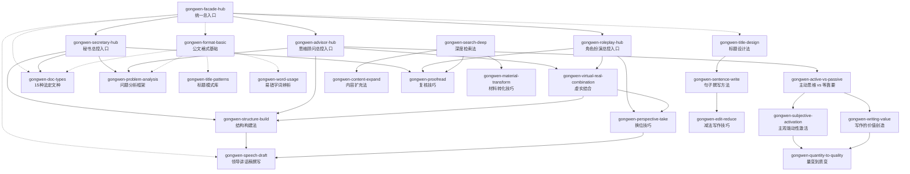

# 公文写作技能包 - 技能索引

> **技能包名称**: gongwen-writing-taoranxuejie-pack
> **来源**: 《从零开始学公文写作》+ 《公文写作大手笔》(陶然学姐)
> **用途**: 以秘书、思维顾问、角色扮演三种角色处理公文写作任务

---

## 总览

本技能包包含 24 个技能，其中 1 个 facade 总入口、3 个角色总控入口、20 个原始子技能。

| 类别 | 数量 | 说明 |
|---|---|---|
| **Facade 入口** (entry) | 1 | 负责全包统一诊断、总分流与混合需求拆链 |
| **角色入口** (entry) | 3 | 负责秘书、顾问、角色扮演三类总路由 |
| **方法类** (method) | 10 | 直接执行起草、扩写、压缩、修改、复核 |
| **知识类** (knowledge) | 5 | 负责文种、格式、审题、标题模式、用词规范 |
| **概念类** (concept) | 5 | 负责心态、站位、虚实比例、训练与价值感 |

**合计**: 24 个技能

---

## Facade 入口

| 技能名 | 入口定位 | 关键 trigger |
|---|---|---|
| [gongwen-facade-hub](entry/gongwen-facade-hub/SKILL.md) | 技能包统一总入口，先做意图诊断，再路由到角色入口或专用技能 | "这个材料怎么处理"、"先看看该怎么做"、"既想改又想学" |

---

## 角色入口

| 技能名 | 入口定位 | 关键 trigger |
|---|---|---|
| [gongwen-secretary-hub](entry/gongwen-secretary-hub/SKILL.md) | 秘书总控入口，直接交付写作结果 | "帮我写一份通知"、"把这篇总结改一下"、"给我出一版讲话稿" |
| [gongwen-advisor-hub](entry/gongwen-advisor-hub/SKILL.md) | 思维顾问总控入口，诊断卡点并给方法路径 | "为什么我总写不好"、"这个材料怎么提升站位"、"怎么练公文写作" |
| [gongwen-roleplay-hub](entry/gongwen-roleplay-hub/SKILL.md) | 角色扮演总控入口，模拟领导/前辈/办公室主任反馈 | "你扮演领导批一下"、"模拟汇报场景"、"从上级视角提意见" |

---

## 用户快速调用词表

### 总控层

| 文件 | 定位 | 强触发词 | 说明 |
|---|---|---|---|
| [SKILL.md](SKILL.md) | 技能包根级总控说明 | “公文怎么处理” / “写材料怎么推进” / “既想改又想学” | 用于理解全包入口、四类任务和总路由 |
| [gongwen-facade-hub](entry/gongwen-facade-hub/SKILL.md) | facade 统一总入口 | “这个材料怎么处理” / “先帮我看看该怎么做” / “先判断再告诉我怎么写” | 适合需求混合、目标不完整、先分流再处理 |

### 角色层

| 文件 | 定位 | 强触发词 | 排除词提示 |
|---|---|---|---|
| [gongwen-secretary-hub](entry/gongwen-secretary-hub/SKILL.md) | 秘书入口 | “帮我写一份通知” / “把这篇材料改成熟一点” / “给我一版能直接交的稿子” | 避开“为什么我总写不好”“你扮演领导批一下” |
| [gongwen-advisor-hub](entry/gongwen-advisor-hub/SKILL.md) | 思维顾问入口 | “为什么我总写不好” / “怎么提升站位” / “怎么系统练公文写作” | 避开“帮我直接写一版”“你扮演领导批一下” |
| [gongwen-roleplay-hub](entry/gongwen-roleplay-hub/SKILL.md) | 角色扮演入口 | “你扮演领导批一下” / “模拟汇报” / “从上级视角挑毛病” | 避开“帮我直接写一版”“这个文种怎么选” |

### 快速选择口诀

- 不知道先找谁：先用 `gongwen-facade-hub`
- 直接要成稿：优先 `gongwen-secretary-hub`
- 先问原因和方法：优先 `gongwen-advisor-hub`
- 先要领导或前辈视角：优先 `gongwen-roleplay-hub`

---

## 技能关系图



---

## 角色工作流

### Facade 场景

```text
接收自然语言需求 -> 判断主目标 -> 识别是否混合任务 -> 分流到角色入口或专用技能 -> 如有需要追加第二条技能链
```

**常用技能链**:
`gongwen-facade-hub` -> `gongwen-secretary-hub / gongwen-advisor-hub / gongwen-roleplay-hub`

### 秘书场景

```text
接收已分流的交付任务 -> 补齐对象/目的/时限 -> 判断文种 -> 检索素材 -> 搭结构 -> 生成或改写 -> 复核定稿
```

**常用技能链**:
`gongwen-problem-analysis` -> `gongwen-doc-types` -> `gongwen-search-deep` -> `gongwen-structure-build` -> `gongwen-content-expand` -> `gongwen-proofread`

### 思维顾问场景

```text
接收已分流的诊断任务 -> 判断属于概念/知识/方法哪一层 -> 调取专用技能 -> 给出诊断和练习路径
```

**常用技能链**:
`gongwen-active-vs-passive` -> `gongwen-subjective-activation` -> `gongwen-problem-analysis` -> `gongwen-virtual-real-combination`

### 角色扮演场景

```text
接收已分流的演练任务 -> 明确扮演身份 -> 明确场景和材料 -> 按该角色视角审阅或发问 -> 给出批注和改进建议
```

**常用技能链**:
`gongwen-perspective-take` -> `gongwen-proofread` -> `gongwen-virtual-real-combination`

---

## 方法类技能

| 技能名 | 一句话描述 | 关键 trigger |
|---|---|---|
| [gongwen-search-deep](method/gongwen-search-deep/SKILL.md) | 深度检索法，帮用户找高质量参考素材 | "帮我找参考"、"怎么检索类似表述" |
| [gongwen-title-design](method/gongwen-title-design/SKILL.md) | 标题设计法，解决主标题和小标题问题 | "标题怎么写"、"这个小标题别扭" |
| [gongwen-sentence-write](method/gongwen-sentence-write/SKILL.md) | 句子撰写方法，解决绕、散、空的问题 | "这句话太拗口"、"怎么写得利落" |
| [gongwen-structure-build](method/gongwen-structure-build/SKILL.md) | 结构构建法，先搭框架再写正文 | "结构怎么搭"、"框架乱了" |
| [gongwen-content-expand](method/gongwen-content-expand/SKILL.md) | 内容扩充法，补句、扩句、拔高 | "字数不够"、"内容太空" |
| [gongwen-edit-reduce](method/gongwen-edit-reduce/SKILL.md) | 减法写作技巧，删掉啰嗦和重复 | "帮我压缩一下"、"太长了" |
| [gongwen-proofread](method/gongwen-proofread/SKILL.md) | 复核技巧，做终稿前检查 | "帮我看看有没有问题"、"做一遍终审" |
| [gongwen-perspective-take](method/gongwen-perspective-take/SKILL.md) | 换位技巧，从领导或上级视角修站位 | "站位不够"、"不像领导稿" |
| [gongwen-material-transform](method/gongwen-material-transform/SKILL.md) | 材料转化技巧，一个素材多种写法 | "这段还能怎么写"、"换个表述方式" |
| [gongwen-speech-draft](method/gongwen-speech-draft/SKILL.md) | 讲话稿专项技能，处理会议发言和领导讲话 | "写讲话稿"、"领导发言提纲怎么搭" |

---

## 知识类技能

| 技能名 | 一句话描述 | 关键 trigger |
|---|---|---|
| [gongwen-doc-types](knowledge/gongwen-doc-types/SKILL.md) | 判断文种及其适用场景 | "该用什么文种"、"通知和通报差别是什么" |
| [gongwen-format-basic](knowledge/gongwen-format-basic/SKILL.md) | 提供格式、字体、版式基础知识 | "格式怎么设"、"字号有要求吗" |
| [gongwen-problem-analysis](knowledge/gongwen-problem-analysis/SKILL.md) | 四看审题法，识别领导真实需求 | "这题怎么审"、"领导想要什么" |
| [gongwen-title-patterns](knowledge/gongwen-title-patterns/SKILL.md) | 标题模式库和小标题排布参考 | "标题格式有哪些套路"、"这组小标题怎么排" |
| [gongwen-word-usage](knowledge/gongwen-word-usage/SKILL.md) | 易错字词与身份匹配表达 | "这个词能不能用"、"措辞准不准" |

---

## 概念类技能

| 技能名 | 一句话描述 | 关键 trigger |
|---|---|---|
| [gongwen-active-vs-passive](concept/gongwen-active-vs-passive/SKILL.md) | 主动思维 vs 等靠要，处理接任务时的抗拒 | "我不会写"、"等别人给模板" |
| [gongwen-subjective-activation](concept/gongwen-subjective-activation/SKILL.md) | 主观能动性激活，推动自己先动起来 | "我没写过所以做不了"、"不知道该从哪查" |
| [gongwen-virtual-real-combination](concept/gongwen-virtual-real-combination/SKILL.md) | 虚实结合，解决高度不足或流水账 | "太虚了"、"太实了没高度" |
| [gongwen-writing-value](concept/gongwen-writing-value/SKILL.md) | 写作的价值创造，建立长期投入感 | "写材料有什么用"、"值不值得学" |
| [gongwen-quantity-to-quality](concept/gongwen-quantity-to-quality/SKILL.md) | 量变到质变，建立刻意练习机制 | "写了很多还是没进步"、"怎么提升" |

---

## 推荐路径

### 新人入门路径

1. [gongwen-active-vs-passive](concept/gongwen-active-vs-passive/SKILL.md) - 建立主动思维
2. [gongwen-format-basic](knowledge/gongwen-format-basic/SKILL.md) - 掌握格式规范
3. [gongwen-problem-analysis](knowledge/gongwen-problem-analysis/SKILL.md) - 学会审题
4. [gongwen-title-design](method/gongwen-title-design/SKILL.md) - 学会写标题
5. [gongwen-proofread](method/gongwen-proofread/SKILL.md) - 学会检查和收口

### 进阶提升路径

1. [gongwen-search-deep](method/gongwen-search-deep/SKILL.md) - 深度检索
2. [gongwen-structure-build](method/gongwen-structure-build/SKILL.md) - 结构构建
3. [gongwen-perspective-take](method/gongwen-perspective-take/SKILL.md) - 换位技巧
4. [gongwen-virtual-real-combination](concept/gongwen-virtual-real-combination/SKILL.md) - 虚实结合
5. [gongwen-speech-draft](method/gongwen-speech-draft/SKILL.md) - 讲话稿专项

### 高手突破路径

1. [gongwen-quantity-to-quality](concept/gongwen-quantity-to-quality/SKILL.md) - 量变到质变
2. [gongwen-material-transform](method/gongwen-material-transform/SKILL.md) - 材料转化
3. [gongwen-content-expand](method/gongwen-content-expand/SKILL.md) - 内容扩充
4. [gongwen-writing-value](concept/gongwen-writing-value/SKILL.md) - 写作价值
5. [gongwen-roleplay-hub](entry/gongwen-roleplay-hub/SKILL.md) - 用角色扮演做高强度复盘

### 默认调用路径

1. [gongwen-facade-hub](entry/gongwen-facade-hub/SKILL.md) - 统一诊断与总分流
2. [gongwen-secretary-hub](entry/gongwen-secretary-hub/SKILL.md) - 直接交付写作结果
3. [gongwen-advisor-hub](entry/gongwen-advisor-hub/SKILL.md) - 处理方法诊断与训练
4. [gongwen-roleplay-hub](entry/gongwen-roleplay-hub/SKILL.md) - 处理领导视角反馈与预演

---

## 审计信息

- **创建时间**: 2026-05-14
- **来源书籍**: 《从零开始学公文写作》(2023) + 《公文写作大手笔》(2024)
- **作者**: 陶然学姐
- **技能总数**: 24 个
- **新增入口**: 1 个 facade 总入口 + 3 个角色总控技能
- **维护者**: Claude Code + skill-package-builder
- **最后更新**: 2026-05-14（统一frontmatter格式、修复无效引用）
